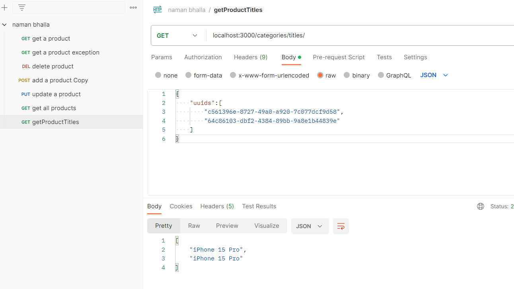
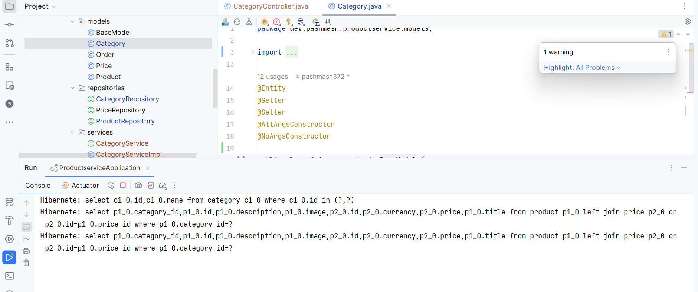
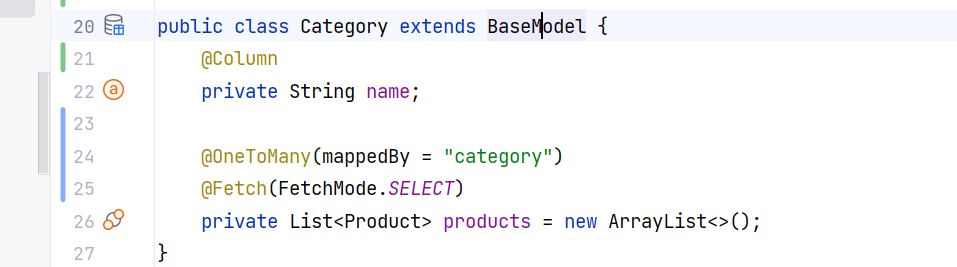
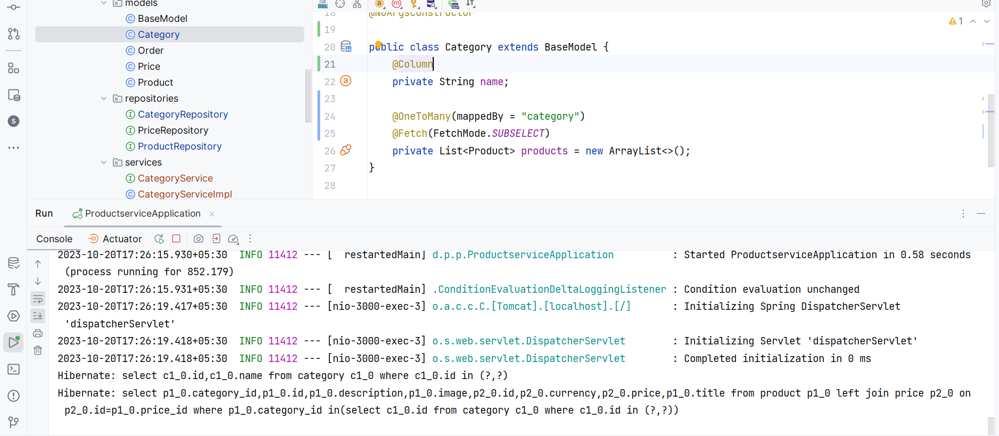

lazy vs eager

when you see somehow lazy not working , leads to lot of slow down
go for eager

for non collection always eager

as you can see below 3 db calls happens  for each lazy call

with select  

now with subselect 2 db call happened  ==> SUBQUERY

THIS IS N+1 problem